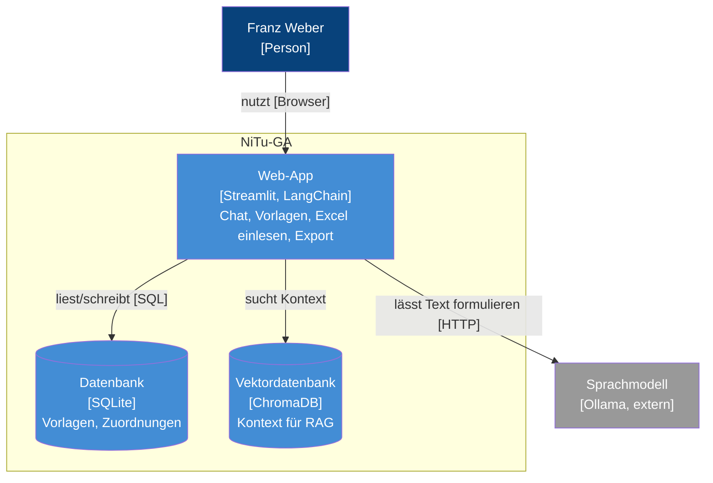

# C4 Ebene 2: Container

```mermaid
flowchart TB
    franz["Franz Weber<br/>[Person]"]
    subgraph nitu["NiTu-GA"]
        web["Web-App<br/>[Streamlit, LangChain]<br/>Chat, Vorlagen, Excel einlesen, Export"]
        db[("Datenbank<br/>[SQLite]<br/>Vorlagen, Zuordnungen")]
        vec[("Vektordatenbank<br/>[ChromaDB]<br/>Kontext für RAG")]
    end
    llm["Sprachmodell<br/>[Ollama, extern]"]

    franz -- "nutzt [Browser]" --> web
    web -- "liest/schreibt [SQL]" --> db
    web -- "sucht Kontext" --> vec
    web -- "lässt Text formulieren [HTTP]" --> llm

    classDef person fill:#08427b,color:#fff
    classDef cont fill:#438dd5,color:#fff
    classDef ext fill:#999,color:#fff
    class franz person
    class web,db,vec cont
    class llm ext
```

Legende: dunkelblau = Person, hellblau = Container, grau = externes System.
