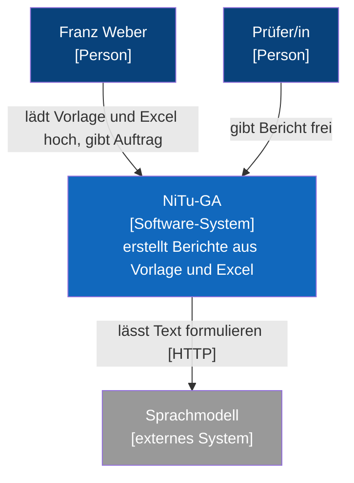

# C4 Ebene 1: System Context

```mermaid
flowchart TB
    franz["Franz Weber<br/>[Person]"]
    pruefer["Prüfer/in<br/>[Person]"]
    nitu["NiTu-GA<br/>[Software-System]<br/>erstellt Berichte aus Vorlage und Excel"]
    llm["Sprachmodell<br/>[externes System]"]

    franz -- "lädt Vorlage und Excel hoch, gibt Auftrag" --> nitu
    pruefer -- "gibt Bericht frei" --> nitu
    nitu -- "lässt Text formulieren [HTTP]" --> llm

    classDef person fill:#08427b,color:#fff
    classDef system fill:#1168bd,color:#fff
    classDef ext fill:#999,color:#fff
    class franz,pruefer person
    class nitu system
    class llm ext
```

Legende: dunkelblau = Person, blau = unser System, grau = externes System.
